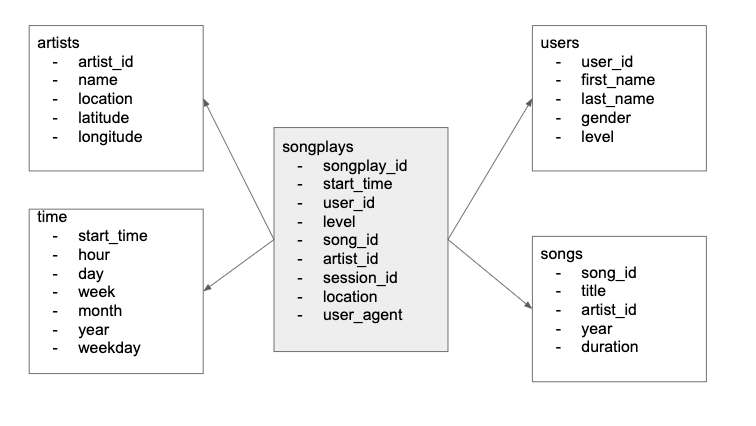

# DataModelling with Postgresql

The project is a simple data modelling exercise to collect the data from heterogenous sources and store in a PostgreSQL.

## Data Storage Format: STAR SCHEMA
The songplays table is the fact table which is connected to the various dimension tables as shown.



## Prerequisites
1. Postgresql
2. Python 3.5 or above

## Getting Started
You need to install python dependencies. Open your terminal and execute:

```
pip install -r requirements.txt
```

## Executing and Setting Up
After the pre-requisites are satisfied:
In Terminal/CommandPromt:
Create the database: studentdb, username: student, password: student
```
python create_tables.py
```
Populate the database
```
python etl.py
```

## Author
* **Rupali Sinha** - *Initial work*


